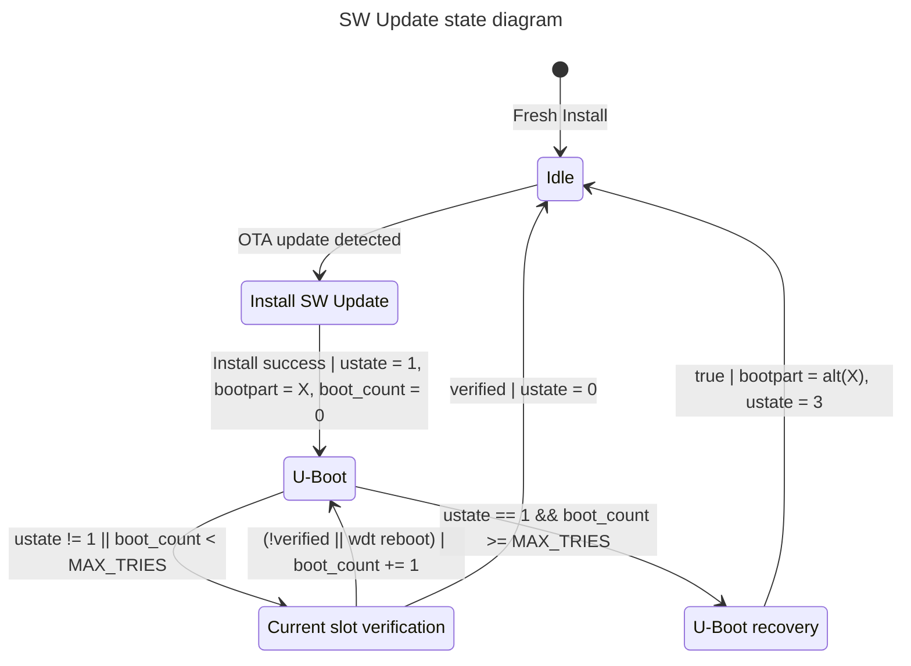

# SW Updates



 Corrected state machine

 ```mermaid
 stateDiagram-v2
     idle     : Idle (confirmed)
     swu      : Installing (SWUpdate)
     uboot    : U-Boot arbitration
     trial    : Trial boot (unconfirmed)
     fallback : U-Boot fallback

     [*] --> idle : Fresh install | ustate=0, bootcount=0

     idle --> swu   : OTA offered && ustate == 0
     swu  --> idle  : install / signature failure | ustate=3
     swu  --> uboot : install success | bootenv{bootpart=standby, bootcount=0, ustate=1}

     uboot --> fallback : ustate == 1 && bootcount >= bootlimit
     uboot --> trial    : ustate == 1 | bootcount += 1, saveenv
     uboot --> idle     : ustate != 1

     trial --> idle  : health check passed | ustate=0, bootcount=0
     trial --> uboot : check failed / panic / hang / WDT / power loss

     fallback --> uboot : bootpart=alt(bootpart), ustate=3, bootcount=0
```
